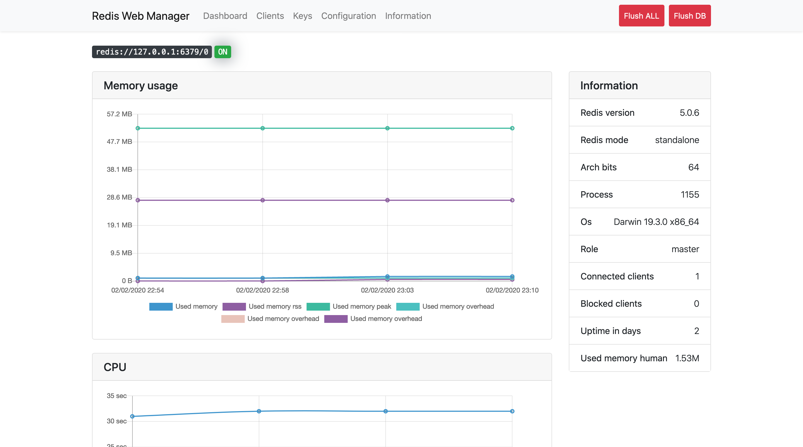
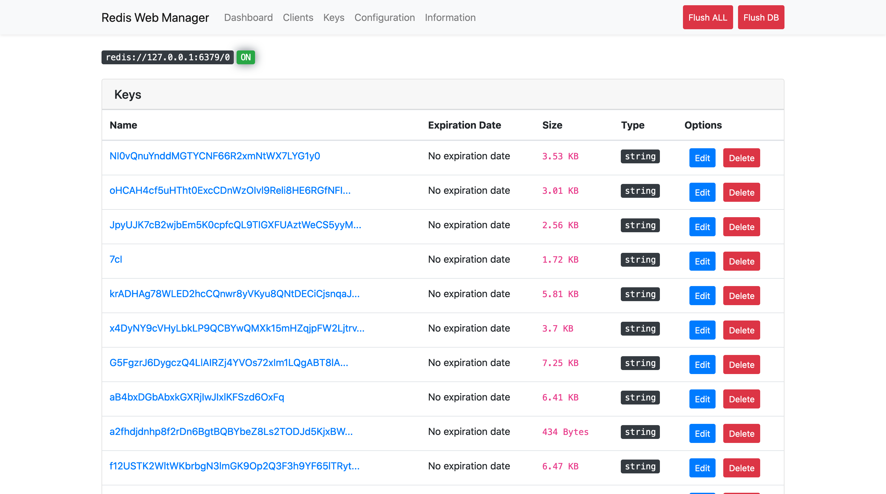

# RedisWebManager

[](https://badge.fury.io/rb/redis_web_manager)
[](https://codeclimate.com/github/OpenGems/redis_web_manager/maintainability)
[](https://travis-ci.org/OpenGems/redis_web_manager)
[](https://hakiri.io/github/OpenGems/redis_web_manager/master)

[](https://coveralls.io/github/OpenGems/redis_web_manager?branch=master)

Web interface that allows you to manage easily your Redis instance (see keys, memory used, connected client, etc...). 

### Check your stats 
The Dashboard allows you tu check the Memory usage, CPU and Redis clients.



### Manage your redis keys
You can easily edit and delete any keys stored in your redis database.



### Keep an eye on your redis clients
Check how many clients are connected and their infos.


## Usage

## Installation
Add this line to your application's Gemfile:

```ruby
gem 'redis_web_manager'
```

And then execute:
```bash
$ bundle
```

Or install it yourself as:
```bash
$ gem install redis_web_manager
```

## Contributing
Contribution directions go here.

## License
The gem is available as open source under the terms of the [MIT License](https://opensource.org/licenses/MIT).
